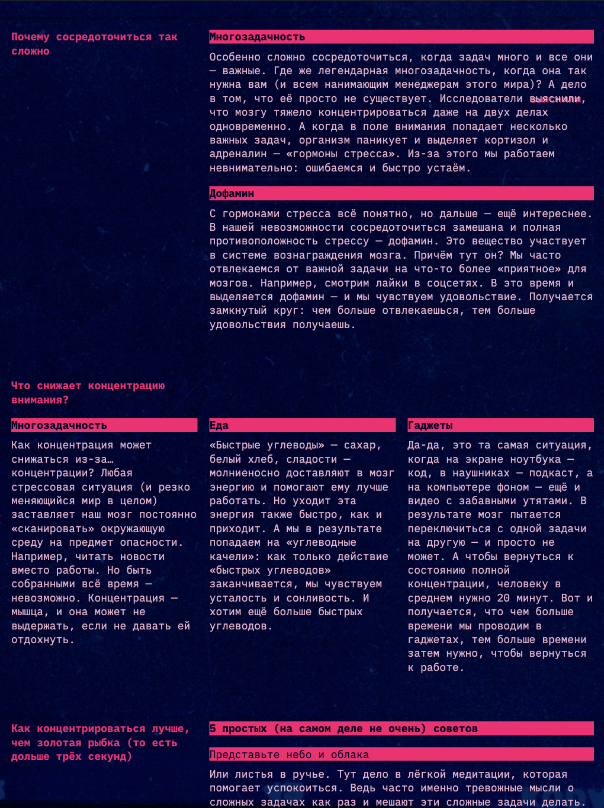
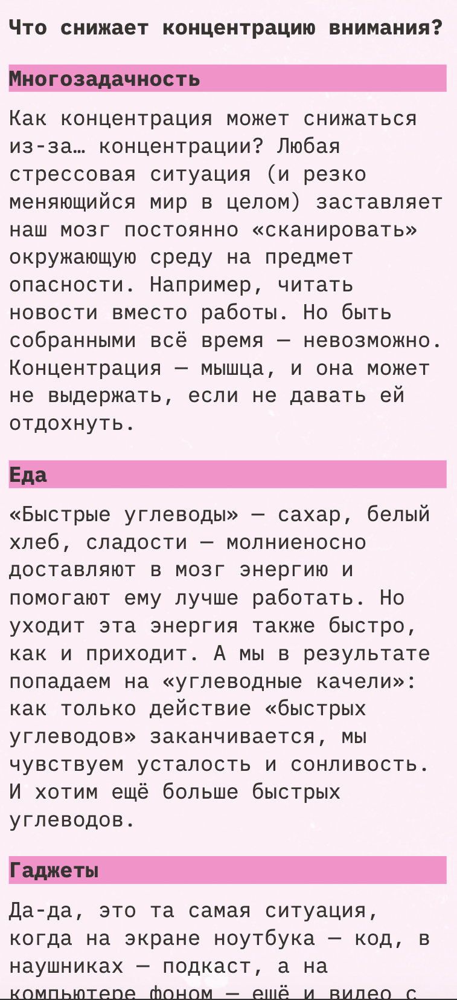

# Сложно сосредоточиться — сайт с адаптивным интерфейсом

«Сложно сосредоточиться» — это учебный проект, созданный в рамках курса «Фронтенд-разработчик» от «Яндекс Практикума». Представляет из себя страницу с интерфейсом, адаптирующимся под экран пользователя и поддерживающим смену цветовой темы.

<table align="center">
  <tr>
    <td align="center">
       
      <b>Страница в разрешении ПК с темной темой</b>
    </td>
    <td align="center">
       
      <b>Страница в мобильном разрешении со светлой темой</b>
    </td>
  </tr>
</table>

## Технологии

<table align="center">
  <tr>
    <td align="center">
       
      HTML5
    </td>
    <td align="center">
       
      CSS3
    </td>
  </tr>
</table>

## Особенности

- Изменение лэйаута в зависимости от ширины экрана

- Поддержка светлой и темной темы

## Задачи

В рамках этого проекта я выполнил следующие задачи.

- Подготовил HTML, подключил стили и фавиконки, настроил цветовую схему.

- Добавил фоновое изображение страницы с фиксированной позицией.

- Свертсал хэдер, основной контент и футер с помощью гридов.

- Настроил адаптацию текста под разные разрешения с помощью функции clamp().

- Стилизовал элементы в фокусе с помощью псевдокласса :focus-visible.

- Создал CSS-переменные для цветов, шрифта, размеров текста и отступов.

- Реализовал «ленивую» загрузку галереи.

- Реализовал адаптивность интерфейса с помощью медиазапросов.

- Реализовал переключение цветовой темы.
